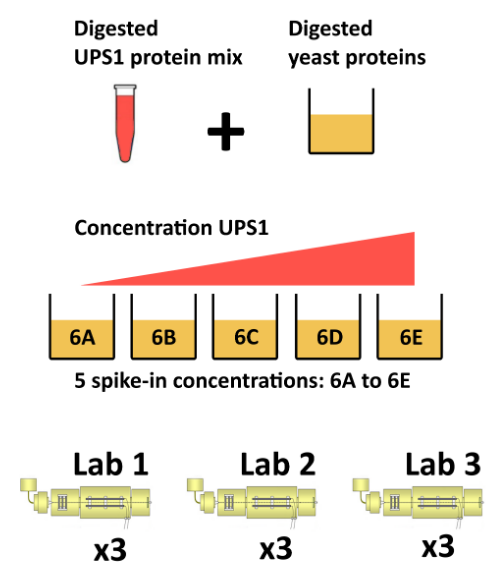

```{r style, echo = FALSE, results = 'asis', message = FALSE}
library(BiocStyle)
knitr::opts_chunk$set(echo = TRUE,
                      message = FALSE,
                      collapse = TRUE)
```

**Last modified:** `r file.info("v02-QFeaturesPipeline")$mtime`<br />
**Compiled**: `r date()`


**Learning Objectives** The goals of this workshop are to provide a
real-life example of step-by-step quantitative proteomics data
analysis using the `QFeatures` package. This vignette demonstrates an
application using spiked-in data.


## Analysis pipeline

Quantitative proteomics data processing is composed of the following
steps:

- Data import
- Exploratory data analysis (PCA)
- Missing data management (filtering and/or imputation)
- Data cleaning
- Transformation and normalisation
- Aggregation
- Downstream analysis


### The CPTAC data

The CPTAC spike-in study 6 [@Paulovich:2010] combines the Sigma UPS1
standard containing 48 different human proteins that are spiked in at
5 different concentrations (conditions A to E) into a constant yeast
protein background. The sample were acquired in triplicate on
different instruments in different labs. We are going to start with a
subset of the CPTAC study 6 containing conditions A and B for a single
lab.

```{r cptac, echo = FALSE, fig.cap = "The CPTAC spike-in study design (credit Lieven Clement, statOmics, Ghent University).", out.width='70%', fig.align='center'}

```

The peptide-level data, as processed by MaxQuant [@Cox:2008] is
available in the `msdata` package:


```{r msdata}
basename(f <- msdata::quant(pattern = "cptac", full.names = TRUE))
```

From the names of the columns, we see that the quantitative columns,
starting with `"Intensity."` (note the dot!) are at positions 56 to
61.

```{r cptac_cols}
names(read.delim(f))
(i <- grep("Intensity\\.", names(read.delim(f))))
```

We now read these data using the `readSummarizedExperiment`
function. This peptide-level expression data will be imported into R
as an instance of class `SummarizedExperiment`. We also use the
`fnames` argument to set the row-names of the `peptides` assay to the
peptide sequences and specify that the file is a tab-separated table.

```{r readse}
cptac_se <- readSummarizedExperiment(f, ecol = i, fnames = "Sequence", sep = "\t")
cptac_se
```

Before proceeding, we are going to clean up the sample names and
annotate the experiment:

```{r cptac_names}
colnames(cptac_se) <- sub("I.+\\.", "", colnames(cptac_se))
cptac_se$condition <- sub("_[7-9]", "", colnames(cptac_se))
cptac_se$id <- sub("^.+_", "", colnames(cptac_se))
colData(cptac_se)
```

Let's also keep only a subset of

```{r vars}
keep_var <- c("Sequence", "Proteins", "Leading.razor.protein", "PEP",
              "Score", "Reverse", "Potential.contaminant")

rowData(cptac_se) <- rowData(cptac_se)[, keep_var]
```

### Missing values

Missing values can be highly frequent in proteomics. These exist two
reasons supporting the existence of missing values, namely biological
or technical.

1. Values that are missing due to the absence (or extremely low
   contentration) of a protein are observed for biological reasons,
   and their pattern **aren't random**. A protein missing in due to
   the suppression of its expression will not be missing at random: it
   will be missing in the condition in which it was suppressed, and be
   present in the condition where it is expressed.

2. Due to it's data-dependent acquisition, mass spectrometry isn't
   capable to assaying all peptides in a sample. Peptides that are
   less abundant than some of their co-eluting ions, peptides that do
   not ionise well or peptides that do not get identified might be
   sporadically missing in the final quantitation table, despite their
   presence in the biological samples. Their absence patterns are
   **random** in such cases.

Often, third party software that produce quantiative data use zeros
instead of properly reporting missing values. We can use the
`zeroIsNA()` function to replace the `0` by `NA` values in our
`cptac_se` object and then explore the missing data patterns across
columns and rows.


```{r na}
cptac_se <- zeroIsNA(cptac_se)
nNA(cptac_se)
```

```{r imagena, echo = FALSE, fig.cap = "Distribution of missing value (white). Peptides row with more missing values are moved towards the top of the figure."}
.image2 <- function (x, yticks = 10,
                     x.cex.axis = 0.75,
                     y.cex.axis = 0.75,
                     xlab = "Samples",
                     ylab = "Features", ...) {
    nc <- ncol(x)
    nr <- nrow(x)
    lab <- colnames(x)
    if (is.null(lab))
        lab <- 1:nc
    graphics::image(t(x), xlab = xlab, ylab = ylab,
                    xaxt = "n",
                    yaxt = "n", ...)
    axis(1, seq(0, 1, 1/(nc - 1)), labels = lab, cex.axis = x.cex.axis)
    yticks <- seq(0, 1, 1/(yticks - 1)) * nr
    axis(2, seq(0, 1, 1/(length(yticks) - 1)),
         labels = round(yticks, 0),
         cex.axis = y.cex.axis)
    invisible(NULL)
}
.x <- is.na(assay(cptac_se))
o <- order(rowSums(.x))
.image2(.x[o, ],
        col = c("black", "white"),
        ylab = "Peptides")
```

Let's now explore these missing values:

- Explore the number or proportion of missing values across peptides
  and samples of the `cptac_se` data.

```{r na2}
barplot(nNA(cptac_se)$nNAcols$pNA)

table(nNA(cptac_se)$nNArows$nNA)
```

- Remove row that have *too many* missing values. You can do this by
  hand or using the `filterNA()` function.

```{r filterna}
## remove rows that have 4 or more NAs out of 6
cptac_se <- filterNA(cptac_se, pNA = 4/6)
```


### Imputation

Imputation is the technique of replacing missing data with probable
values. This can be done with `impute()` method. As we have discussed
above, there are however two types of missing values in mass
spectrometry-based proteomics, namely data missing at random (MAR),
and data missing not at random (MNAR). These two types of missing data
need to be imputed with [different types of imputation
methods](https://rformassspectrometry.github.io/QFeatures/articles/Processing.html#imputation-1)
[@Lazar:2016].


```{r miximp, echo = FALSE, fig.cap = "Mixed imputation method. Black cells represent presence of quantitation values and light grey corresponds to missing data. The two groups of interest are depicted in green and blue along the heatmap columns. Two classes of proteins are annotated on the left: yellow are proteins with randomly occurring missing values (if any) while proteins in brown are candidates for non-random missing value imputation."}
data(se_na2)
x <- assay(impute(se_na2, "zero"))
x[x != 0] <- 1
suppressPackageStartupMessages(library("gplots"))
heatmap.2(x, col = c("lightgray", "black"),
          scale = "none", dendrogram = "none",
          trace = "none", keysize = 0.5, key = FALSE,
          RowSideColors = ifelse(rowData(se_na2)$randna, "orange", "brown"),
          ColSideColors = rep(c("steelblue", "darkolivegreen"), each = 8))
```

When downstream analyses permit, it might thus be safer not to impute
data and deal explicitly with missing values. This is possible when
performing hypethesis tests, but not to perform a principal component
analysis.


### Identification quality control

As discussed in the previous chapter, PSMs are deemed relevant after
comparison against hist from a decoy database. The origin of these
hits is recorded with `+` in the `Reverse` variable:

```{r rev}
table(rowData(cptac_se)$Reverse)
```

Similarly, a proteomics experiment is also searched against a database
of contaminants:

```{r cont}
table(rowData(cptac_se)$Potential.contaminant)
```

Let's visualise some of the cptac's metadata using standard `ggplot2`
code:

- Visualise the score distributions from forward and reverse hits and
  interpret the figure.

```{r idqc1}
rowData(cptac_se) %>%
    as_tibble() %>%
    ggplot(aes(x = Score, colour = Reverse)) +
    geom_density()

```

- Do the same with the posterior probability score (PEP).

```{r idqc2}
rowData(cptac_se) %>%
    as_tibble() %>%
    ggplot(aes(x = PEP, colour = Reverse)) +
    geom_density()
```


### Creating the QFeatures data

We can now create our `QFeatures` object using the
`SummarizedExperiment` as show below.

```{r qf}
cptac <- QFeatures(list(peptides = cptac_se))
cptac
```

We should also assign the `QFeatures` column data with the
`SummarizedExperiment` slot.

```{r qfcd}
colData(cptac) <- colData(cptac_se)
```

Note that it is also possible to directly create a `QFeatures` object
with the `readQFeatures()` function and the same arguments as the
`readSummarizedExperiment()` used above. In addition, most functions
used above and below work on single `SummarizedExperiment` objects or
assays within a `QFeatures` object.


### Filtering out contaminants and reverse hits

Using the `filterFeatures()` function, filter out the reverse and
contaminant hits.


```{r qcfilter}
cptac <-
    cptac %>%
    filterFeatures(~ Reverse != "+") %>%
    filterFeatures(~ Potential.contaminant != "+")
```


### Log-transformation and normaliation


The two code chunks below log-transform and normalise using the assay
`i` as input and adding a new one names as defined by `name`.

```{r log}
cptac <- logTransform(cptac, i = "peptides",
                      name = "log_peptides")
```

```{r nrom}
cptac <- normalize(cptac, i = "log_peptides",
                   name = "lognorm_peptides",
                   method = "center.median")
```

```{r plotdens, fig.cap = "Three peptide level assays: raw data, log transformed and normalised.", fig.width = 15, fig.height = 5}
par(mfrow = c(1, 3))
limma::plotDensities(assay(cptac[["peptides"]]))
limma::plotDensities(assay(cptac[["log_peptides"]]))
limma::plotDensities(assay(cptac[["lognorm_peptides"]]))
```

### Aggregation

Below, we are going to use median aggregation, as a first
attempt. This is however not the best choice, as we will see later.


```{r qfagg1, message = FALSE}
cptac <-
    aggregateFeatures(cptac,
                      "lognorm_peptides",
                      name = "proteins_med",
                      fcol = "Leading.razor.protein",
                      fun = colMedians,
                      na.rm = TRUE)
```

Looking at the `.n` row variable computed during the aggregation, we
see that most proteins result of the aggregation of 5 peptides or
less, while very few proteins are accounted for by tens of peptides.

```{r}
table(rowData(cptac[["proteins_med"]])$.n)
```

### Principal component analysis


```{r pca, message = FALSE}
library("factoextra")
library("patchwork")

pca_pep <-
    cptac[["lognorm_peptides"]] %>%
    filterNA() %>%
    assay() %>%
    t() %>%
    prcomp(scale = TRUE, center = TRUE) %>%
    fviz_pca_ind(habillage = cptac$condition, title = "Peptides")

pca_prot <-
    cptac[["proteins_med"]] %>%
    filterNA() %>%
    assay() %>%
    t() %>%
    prcomp() %>%
    fviz_pca_ind(habillage = cptac$condition,
                 title = "Proteins (median aggregation)")

```

```{r plotpca, fig.width = 12, fig.height = 6, fig.cap = "Peptide and protein level PCA analyses."}
pca_pep + pca_prot
```

### Visualisation


Below, we use the `longFormat()` function to extract the quantitative
and row data in a long format, that can be directly reused by the
tidyverse tools.


```{r vis, message = FALSE, warning = FALSE, fig.width = 12, fig.height = 6, fig.cap = "Peptide and protein expression profile."}
longFormat(cptac["P02787ups|TRFE_HUMAN_UPS", ,
                 c("lognorm_peptides", "proteins_med")]) %>%
    as_tibble() %>%
    mutate(condition = ifelse(grepl("A", colname), "A", "B")) %>%
    ggplot(aes(x = colname, y = value, colour = rowname, shape = condition)) +
    geom_point(size = 3) +
    geom_line(aes(group = rowname)) +
    facet_grid(~ assay) +
    ggtitle("P02787ups|TRFE_HUMAN_UPS")
```

### Statistical analysis


Below, we are going to perform our statistical analysis on the protein
data.


```{r protse}
prots <- cptac[["proteins_med"]]
colData(prots) <- colData(cptac)
```

The `r BiocStyle::Biocpkg("limma")` package is the precursor package
that enables the consistent application of linear models to normalliy
distributed omics data in general, and microarrays in
particuar.

The `limma` package implements an empirical Bayes method that provides
borrows information across features to estimate the standard error and
calculate (so called moderate) t statistics. This approach is
demonstrably more powerful that a standard t-tests when the number of
samples is lot.

The code chunk below illstrated how to set up the model, fit it, and
apply the empirical Bayes moderation.

```{r limma, message = FALSE}
library("limma")
design <- model.matrix(~ prots$condition)
fit <- lmFit(assay(prots), design)
fit <- eBayes(fit)
```

Finally, the `topTable()` function is used the extract the results for
the coefficient of interest.

```{r res}
res <-
    topTable(fit, coef = "prots$condition6B", number = Inf) %>%
    rownames_to_column("protein") %>%
    as_tibble() %>%
    mutate(TP = grepl("ups", protein))
```

Note the warning about partial `NA` coefficients for 23 probes:

```{r nacoefs}
na_coefs <-
    filter(res, is.na(t)) %>%
    pull(protein)
assay(prots[na_coefs, ])
```

We can now visualise the results using a volcano plot:

```{r vp, fig.cap = "Volcano plot highlighing spiked-in proteins in red."}
res %>%
    ggplot(aes(x = logFC, y = -log10(adj.P.Val))) +
    geom_point(aes(colour = TP)) +
    geom_vline(xintercept = c(-1, 1)) +
    geom_hline(yintercept = -log10(0.05)) +
    scale_color_manual(values = c("black","red"))
```


Using the pipeline described above, we would would identify a single
differentially expressed protein at an 5 percent FDR but miss out the
other `r sum(res$TP) - 1` expected spike-in proteins.

We can assess our results in terms of true/false postitves/negatives:

- True positives: `r nrow(filter(res, adj.P.Val < 0.05 & TP))`
- False positives: `r nrow(filter(res, adj.P.Val < 0.05 & !TP))`
- True negatives: `r nrow(filter(res, adj.P.Val > 0.05 & !TP))`
- False negatives: `r nrow(filter(res, adj.P.Val > 0.05 & TP))`


## Final exercise

As shown below, it is possible to substantially improve these results
by aggregating features using a robust summarisation (available as
`MsCoreUtils::robustSummary()`), i.e robust regression with
M-estimation using Huber weights, as described in section 2.7 in
[@Sticker:2019].


```{r echo = FALSE, message = FALSE, warning = FALSE, fig.cap = "Aggregation using robust summarisation."}
cptac <-
    aggregateFeatures(cptac,
                      "lognorm_peptides",
                      name = "proteins_rob",
                      fcol = "Leading.razor.protein",
                      fun = MsCoreUtils::robustSummary,
                      na.rm = TRUE)

prots <- cptac[["proteins_rob"]]
colData(prots) <- colData(cptac)

design <- model.matrix(~ prots$condition)
fit <- lmFit(assay(prots), design)
fit <- eBayes(fit)

res <- topTable(fit, coef = "prots$condition6B", number = Inf) %>%
    rownames_to_column("protein") %>%
    as_tibble() %>%
    mutate(TP = grepl("ups", protein))

res %>%
    ggplot(aes(x = logFC, y = -log10(adj.P.Val))) +
    geom_point(aes(colour = TP)) +
    geom_vline(xintercept = c(-1, 1)) +
    geom_hline(yintercept = -log10(0.05)) +
    scale_color_manual(values = c("black","red"))
```

- True positives: `r nrow(filter(res, adj.P.Val < 0.05 & TP))`
- False positives: `r nrow(filter(res, adj.P.Val < 0.05 & !TP))`
- True negatives: `r nrow(filter(res, adj.P.Val > 0.05 & !TP))`
- False negatives: `r nrow(filter(res, adj.P.Val > 0.05 & TP))`

Repeat and adapt what we have seen here using, for example, the
`robustSummary()` function.

## Session information

```{r si}
sessionInfo()
```

## References {-}
